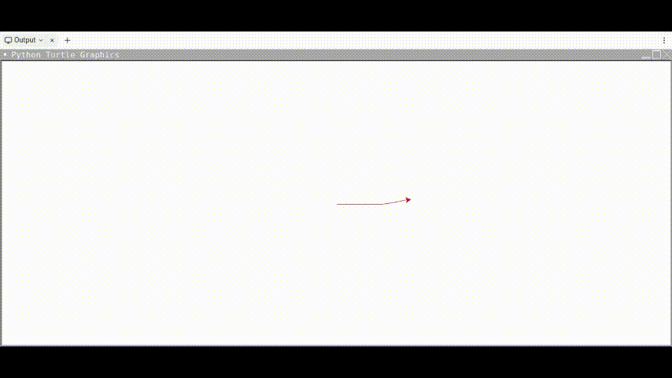

## Day 19 Instances, State and Higher Order Functions

**The Final Project**

- [etch-a-sketch](https://replit.com/@supercodr/day-19-start)

---

### Etch-a-Sketch Project

To move the turtle in different directions  use keyboard:

| Move        	| key 	|
|-------------	|-----	|
| forward     	|  W  	|
| back        	|  S  	|
| right       	|  D  	|
| left        	|  F  	|
| half moon   	|  H  	|
| clear/reset 	|  C  	|