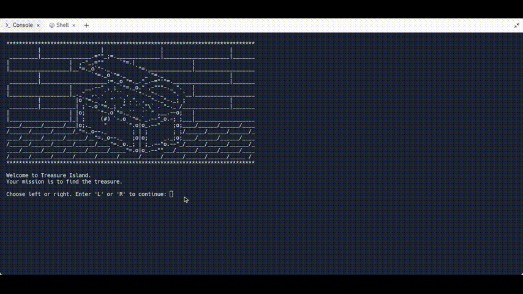

## Day 3 Control Flow and Logical Operators

- 1.Exercise: [Odd or Even](https://replit.com/@supercodr/day-3-odd-or-even)
- 2.Exercise: [BMI 2.0](https://replit.com/@supercodr/day-3-bmi-2)
- 3.Exercise: [Leap Year](https://replit.com/@supercodr/day-3-leap-year)
- 4.Exercise: [Pizza Order](https://replit.com/@supercodr/day-3-pizza-order-practice)
- 5.Exercise: [Love Calculator](https://replit.com/@supercodr/day-3-love-calculator)

**Day 3 Final Project:**

- [Treasure island](https://replit.com/@supercodr/treasure-island)

---

