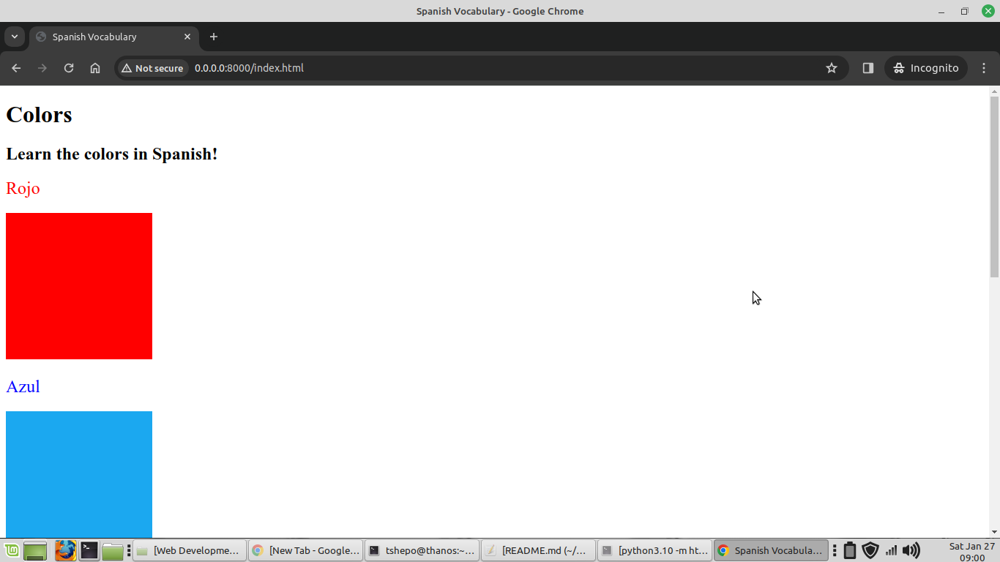

## Day 43 Color Vocab Website

**Final Project**

---

To run the program in a shell:
- start a local server

`$ python3 -m http.server`
- in a web browser address bar - type name of html file

`http://0.0.0.0:8000/index.html`

