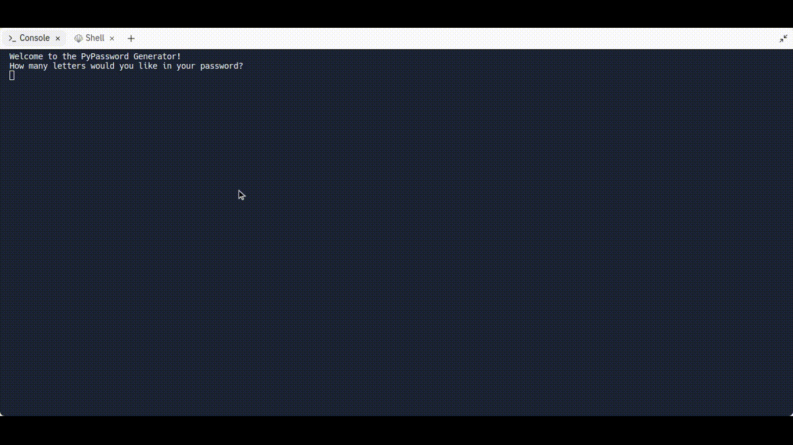

## Day 5 Python Loops

- 1.Exercise: [Average Height](https://replit.com/@supercodr/average-height)
- 2.Exercise: [High Score](https://replit.com/@supercodr/high-score)
- 3.Exercise: [Adding Even Numbers](https://replit.com/@supercodr/adding-even-numbers)
- 4.Exercise: [FizzBuzz](https://replit.com/@supercodr/fizzBuzz)

**Day 5 Final Project:**

- [Password generator](https://replit.com/@supercodr/password-generator-start)

### Password Generator
---
